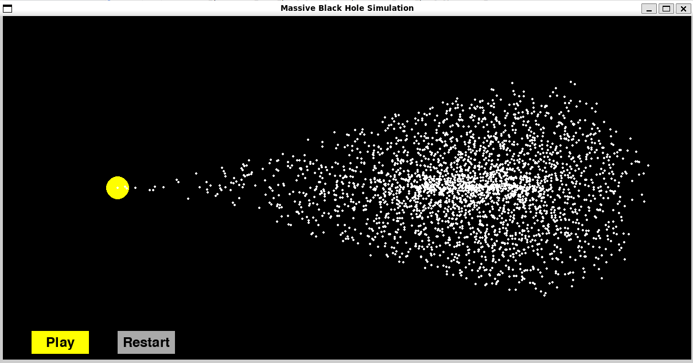

# Black Hole "simulator"

A fun program written entirely by ChatGPT that "simulates" a black hole. It's a simple program that takes user input and provides a response based on the input. The program is written in Python and uses the `random` library to generate random responses.

There is no real simulation happening here, but it's a fun exercise.

